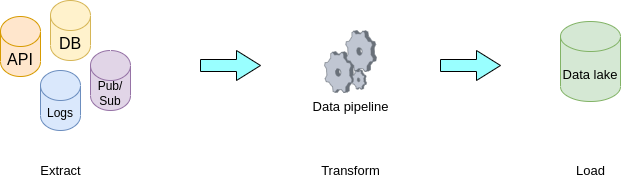
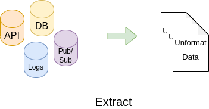
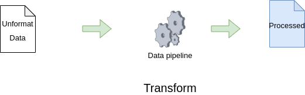
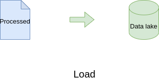

# Data ETL in DevOps processes

In the normal Development and Operation process, we have a lot of **data** or **message** generation.  
We can see the behavior of events from user(client) to the latest service in workflow.  
When a user accesses our platform or service, it is called a **request**.  
The request is one of the message types that we can use to **process** or **analytic**.  
For all transactions on user workflow we have many many **messages**(also data or events)  
to see what happens in your services. Further, we can see other messages on  
the infrastructure layer and Networking layer.

Oftenly, `DevOps processes` focus on the **What happened in our platform**,  
so they use logs messages created by application and observability tools.  
In this session, I will present how DevOps uses previous data to observe  
what happened in your platform and what we should do if we have data.

## What is ETL

**ETL** is called `Extract, Transform and Load`. It is **data integration** that refers to  
three distinct processes. We use to transfer data from multiple sources with  
any format to any data storage and already to visualize future trends or current information.

Next, we can work each function in following:

- **Extract** is used to scrape data from `any sources and any format` like app log, flat file, metrics, or api response.

- **Transform** is used to convert different data formats to the same format, *cleaning data*, *filter useless data*, *add metadata in each message*, and other processes.

- **Load** is used to transfer data that is transformed to store in a **data lake**, **data warehouse**, or other storage.  

In the data pipeline, we can adapt with  
> extract → transformation → load  
> or  
> extract → load → transformation.  

You can design your `data pipeline` base-on your platform and tools.

## ETL in basically

Now, you understand what **ETL** is, but when should we implement them? In begin to,  
answer this question, you need to design `data flow` from top layer to bottom  
or bottom layer to top.

## Data design top layer to bottom

We will gather requirements from **business** about what we need to see in the end.  
Example:

- We need to see how many users have had bad experiences on our platform.
- We need to see where the web page that users focus and oftenly use.
- We need to see what the root cause of our service is broken.
- We need to see what services we should expand resources, improve performance, and scale.
ETC.

We were started with what we need to design `data flow` in the `platform lifecycle`.  
You can use goals from the **engineer team**, **business team**, or **developer team** to design and implement.

### Data design bottom layer to top

We will survey the existing resources and data in our system. Next, we try to expand ideas from our data to what we can see in current data.  
Example:

- We have requested errors and many transactions in a few minutes, so that we can detect this event and analyze what happened and who is facing this problem.
- We have frequency response time more than 3 sec in some features that should have response time less than 3 sec. We can use this data to analyze to see what service has a delay and what is the root cause.
- We have an error log that shows the transaction failed. We can use this data and surround log to analyze what happened.

In my example, you can see patterns on what we have, then how can we use this data  
to analyze what happened currently. In advance, we can analyze information to get  
insight on your information.

## Challenge in data integration

1. In **application factor**, we do not think about data in the software design phase. We expose *useless information* in our services or we do not have *necessary data* that can tell us what we want.

2. In **person factor**, `who is using data not designed, who is designed do not use them`. As explained, the developer team is designing architecture for their services with business requirements, but in the design phase, they have no other team to participate like the operation team or person who is using data from this service to analyze.

3. In **observed tools**, each team will have their stack for *data integration* and other teams can not use this data because they *can not access* this data or *incompatibility* between tools. For example, team-A uses `AWS Redshift` to store data and native AWS service to build their data pipeline, but team-B uses an on-premise stack like `Hadoop` and their developed tool to integrate `Apache Hadoop`. Another team can not access `AWS Redshift` because they have *compliance* or some reason. Then, we have 2 locations to store data that we can not merge and analyze.

Next session, I will talk about simple scenario to use ETL concept on DevOps world.
