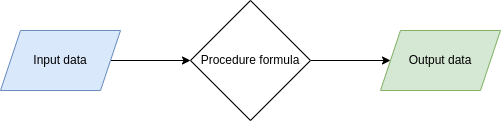
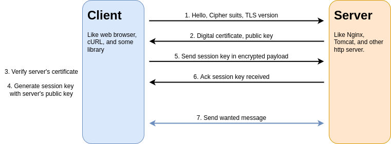
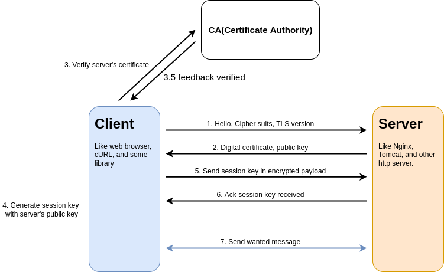

# PKI(Public Key Infrastructure)

This workshop, you can learn about `What is PKI` and `How can we use it`. You can imagine the importance of **security** and **privacy** in customer’s data. This workshop should help you to understand and work with your hand.

`What is PKI?` Before answering this question, you should know to What is **Symmetric** and **Asymmetric** encryption.  

You can understand a key difference between **Symmetric** and **Asymmetric** encryption. In a simple scenario, Asymmetric encryption will be stronger and more secure than Symmetric encryption because we do not use same secret key for encrypt/decrypt messages.  

Information security has grown to be a hugely important factor in any communication, transaction, and ETC. A little vulnerability or weakness in communication that can be leveraged to devastating effects. This session will show you two encryption techniques that can be used to tighten communication security.  

## Little note

1. Algorithm

   

   > a process or set of rules to be followed in calculations or other problem-solving operations.  

   An encryption algorithm that means formula in mathematical procedure for shift a bits or convert in original data. An information is made in cipher text and requires use of the key to transform the data into its original form.

2. Cryptography

   The study of secure communications techniques that allow only the sender and intended recipient of a message to view its contents. The term is derived from the Greek word kryptos, which means hidden. An encryption algorithm will take an original message(plain text) converted to cipher text. We can use the key to **encrypt** or **decrypt** messages.  

## Symmetric encryption

This is a simplest procedure used to convert messages between **plain text** and **cipher text**. We can use the same key in the encryption and decryption process. It’s easy to manage and exchange for sender and receiver to use it. You can allow your services to generate the secret key and exchange in their trusted zone to communicate with a secure tunnel. You mostly set timeout or expire in a secret key to avoid loopholes in capture pattern messages.

Example encryption algorithm such as `Blowfish`, `AES`, `RC4`, `DES`, `RC5`, and `RC6`.

## Asymmetric encryption

There are public and private keys to encrypt/decrypt, which is a new method for isolating one secret key to encryption and one secret key to decryption. You will create two secret keys: public key and private key. It is most likely used to exchange on extranet(also internet) or untrust zone to secure communication. You can share a public key to another person for only encrypting some message and send it to a person that has a private key for decrypting the cipher into the original message.

Example encryption algorithm such as `RSA`, `ECC`, `Diffie-Hellman`, `DSS`, and `DSA`.

## SSL/TLS communication(combination of Asymmetric and Symmetric)

For most likely cases, We can summarize steps for creating communication between client and server. Before any communication, They must initial rules and keys for security. You can follow these steps to understand how they work to create secure communication.

1. Client --> send hello package to target server. In message has client's information such as support cipher suits(algorithms), SSL/TLS versions, and other.
2. Server --> Check client's information that match a policies you configure. If not match they will reject request. For match policies, They send certificate with public key to client.
3. Client --> Verify server's certificate that trusted or not. The certificate information should match in your request like common name, expired date, and ETC.
4. Client --> Create session key(also symmetric secret key) for secure communication tunnel. Then encrypt payload with public key in certificate before send them to server.
5. Server --> Receive message with session key, so decrypt with private key. They send acknowledge message to client for accept this key in secure tunnel.
6. Both --> Send/receive messages with session key. If session key expire, they will repeat above step to establish communication.

## More secure with CA(Certificate Authority)

In the previous topic, We can see some weaknesses in the initial process. If your contact server endpoint is not your target server, they will fake the server or something like that. Can you trust it?  

For solved, You can use CA to help you verify certificates that you can trust. In step 3, you can get the issuer from the server's certificate and ask them to guarantee this certificate.  

If you have doubt in CA issuer from the server certificate. You can trust the root CA in your host, so you will integrity check with the root CA for a guarantee certificate. We call this process is `Chain of trust`.  

Next, We will show you how it work.  
[Go to workshop](./Workshop-selfsign.md)

## Reference

- <https://www.ssl2buy.com/wiki/symmetric-vs-asymmetric-encryption-what-are-differences>
- <https://www.geeksforgeeks.org/introduction-to-algorithms/>
- <https://encryptionconsulting.com/education-center/what-is-cryptography/>
